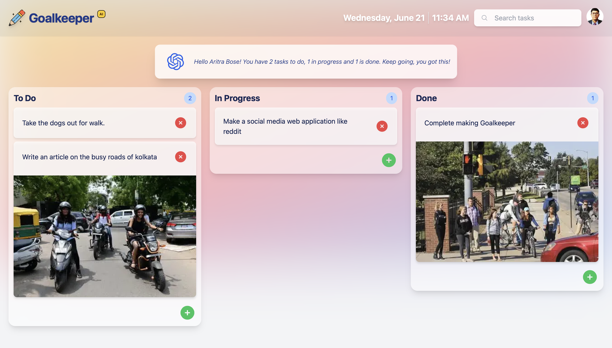

# Goalkeeper: Modern Task Manager with DnD and AI Summarizer

[Goalkeeper](https://goal-keeper.vercel.app) is a powerful web application designed to simplify your task management experience. With its intuitive drag and drop functionality and AI todo summarizer, Goalkeeper helps you stay organized and efficient.

### Features:

- **Drag and Drop:** Easily organize tasks by dragging and dropping them into different categories.
- **AI Todo Summarizer:** Get concise summaries of your to-do items powered by GPT-3.5-Turbo.
- **Not only Text:** You can also add images to your tasks to tailor them to your needs.
- **Responsive Design:** Access Goalkeeper from any device with a fully responsive interface.
- **Secure Authentication:** Protect your data with secure login options.
- **Sleek and Modern Interface:** Enjoy a visually appealing and intuitive user interface.

<hr />

## This section is developers only

### Getting Started

First, run the development server:

```bash
npm run dev
# or
yarn dev
# or
pnpm dev
```

Open [http://localhost:3000](http://localhost:3000) with your browser to see the result.

## Deploy on Vercel

The easiest way to deploy your Next.js app is to use the [Vercel Platform](https://vercel.com/new?utm_medium=default-template&filter=next.js&utm_source=create-next-app&utm_campaign=create-next-app-readme) from the creators of Next.js.

Check out our [Next.js deployment documentation](https://nextjs.org/docs/deployment) for more details.
